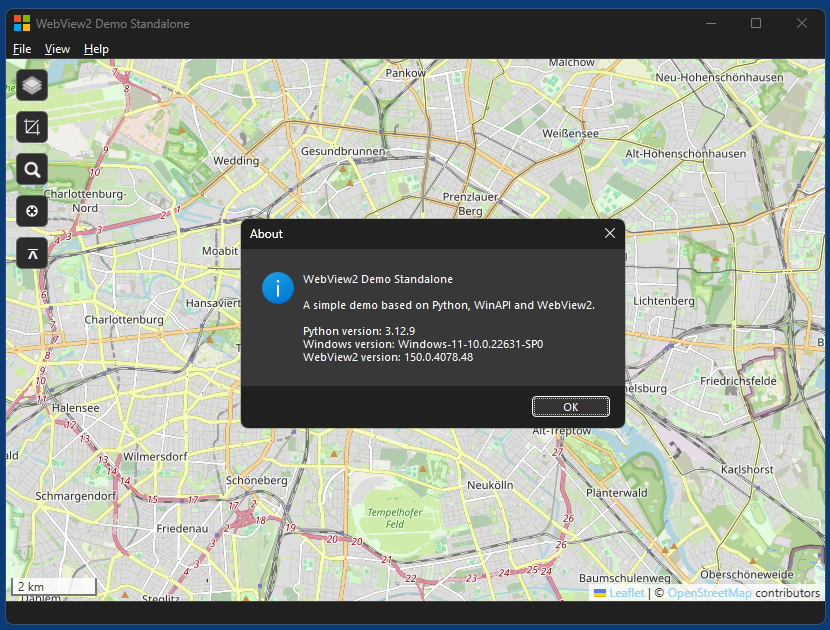

# WebView2-for-Python

WebView2-for-Python is a pure Python binding to [Microsoft Edge WebView2](https://developer.microsoft.com/en-us/microsoft-edge/webview2), a webview control for Windows 11 based on recent versions of Chrome/Chromium.

It can either be used in [standalone mode](src/demos/demo_standalone/) or embedded into common GUI toolkits, simple wrappers are provided for the following toolkits:
* [PyQt5](src/demos/demo_pyqt5/)
* [PyQt6](src/demos/demo_pyqt6/)
* [PySide6](src/demos/demo_pyside6/)
* [Tkinter](src/demos/demo_tkinter/)
* [WinApp](src/demos/demo_winapp/) (my own Windows API toolkit with dark mode support)
* [WinForms](src/demos/demo_winforms/) (Windows Forms)
* [wxPython](src/demos/demo_wxpython/)  (wxWidgets)

## Usage

Minimal code, standalone mode:

```python
from webview2.standalone import *

webview = WebView2(url='https://www.google.com/')
webview.set_focus()
webview.run()
```
For the API check out [\_\_init\_\_.py](src/webview2/__init__.py) and the various [demos](src/demos/).

## Loader

The standard way to initialize WebView2 is to use the `WebView2Loader.dll` that comes with Microsofts's WebView2 SDK. WebView2-for-Python instead uses a [custom loader.dll](loader/). The reason for this is that this small loader.dll allows to use `CreateCoreWebView2EnvironmentWithOptions()` and pass an instance of `CoreWebView2EnvironmentOptions` to it, which requires [WRL](https://learn.microsoft.com/en-us/cpp/cppcx/wrl/windows-runtime-cpp-template-library-wrl) and therefor is hardly possible to implement in plain C or Python/ctypes/libffi code. In particular the `loader.dll` activates support of browser extensions in the used environment.

## Showcase projects

A first showcase project is [LottieView](https://github.com/59de44955ebd/LottieView), a simple and small desktop viewer/player for [Lottie](https://en.wikipedia.org/wiki/Lottie_(file_format)) animation files.

Another showcase project is [SimpleBrowser](https://github.com/59de44955ebd/SimpleBrowser), still work in progress.

## Screenshots
*demo_standalone running in Windows 11 (dark mode)*

